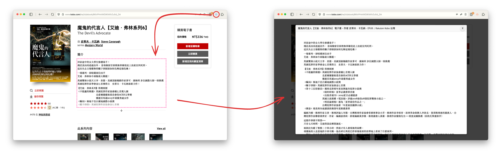

# ZenReader


ZenReader is a Chrome extension designed to provide a distraction-free reading experience while preserving the original styling of web content. It allows users to focus on specific sections of a webpage by creating an overlay that highlights only the content they want to read.



## Features

- **Multiple Activation Methods**:
  - Click the extension icon in the toolbar
  - Use the context menu (right-click on any webpage)
- **Manual Selection Mode**: Select any element on a webpage to focus on
- **Style Preservation**: Keeps original styling of content including fonts, colors, and layouts
- **Responsive Design**: Adjusts to different screen sizes and orientations
- **Multilingual Support**: Available in multiple languages
- **Dark Mode Compatible**: Adapts to system dark mode preferences

## How to Use

1. **Activate ZenReader** by:
   - Clicking the extension icon in your browser toolbar, or
   - Right-clicking anywhere on the page and selecting "Enter Focus Mode"
2. **Select a section** on the webpage you want to focus on (elements will highlight when hovered)
3. **Read content** in distraction-free focus mode
4. **Exit focus mode** by:
   - Pressing the `ESC` key
   - Clicking the exit button in the top-right corner
   - Clicking outside the focus container
   - Clicking the browser toolbar icon again
   - Right-clicking and selecting "Exit Focus Mode"

## Installation

### From Chrome Web Store

_(Coming soon)_

### Manual Installation (Developer Mode)

1. Download or clone this repository
2. Open Chrome and navigate to `chrome://extensions/`
3. Enable `Developer mode` by toggling the switch in the top-right corner
4. Click `Load unpacked` and select the ZenReader directory
5. The extension should now be installed and visible in your toolbar

## Development

### Project Structure

```
ZenReader/
├── manifest.json               # Extension configuration
├── background.js               # Background script for extension management
├── styles.css                  # Global styles for the extension
├── icons/                      # Extension icons in various sizes
├── _locales/                   # Internationalization files
└── content/                    # Content scripts for webpage interaction
    ├── index.js                # Main entry point for content scripts
    ├── focusMode.js            # Reading mode implementation
    ├── selectionMode.js        # Element selection handling
    ├── state.js                # State management
    ├── styles/                 # Style management
    │   ├── elementCloner.js    # Style preservation for cloned elements
    │   ├── layoutFixer.js      # Fixing layout issues
    │   ├── shadowDomStyles.js  # Shadow DOM styling
    │   ├── styleCache.js       # Caching computed styles
    │   └── styleManager.js     # Central style coordination
    └── utils/                  # Utility functions
        ├── colorUtils.js       # Color analysis and manipulation
        ├── domUtils.js         # DOM manipulation utilities
        └── messageHandler.js   # Communication with background script
```

### Building for Production

A build script is included to package the extension for Chrome Web Store submission:

```bash
# Make the script executable
chmod +x build.sh

# Run the build script
./build.sh
```

The script will:

- Extract the current version from manifest.json
- Create a zip file with the necessary files
- Remove development files
- Output a production-ready package

## Technical Details

ZenReader uses Shadow DOM for style encapsulation, ensuring that the original styling of selected content is preserved while preventing style leakage between the webpage and the focus mode interface.

Key technical features:

- **Shadow DOM** for style isolation
- **Style caching system** for performance optimization
- **Color analysis** for adapting to page themes (light/dark)
- **Event propagation management** for proper scrolling behavior
- **Computed style preservation** to maintain the look and feel of original content
- **Special element handling** for images, tables, and code blocks
- **Responsive container sizing** using viewport units
- **RTL language support** for multilingual compatibility

## Browser Compatibility

- Google Chrome (latest version)
- Chromium-based browsers (Edge, Brave, Vivaldi, etc.)

## License

This project is licensed under the MIT License - see the [LICENSE](LICENSE) file for details.

## Contributing

We welcome contributions! Please feel free to submit issues or pull requests.

## Roadmap

Future enhancements being considered:

- Minimum font size settings
- Keyboard shortcut customization
- Additional customization options
